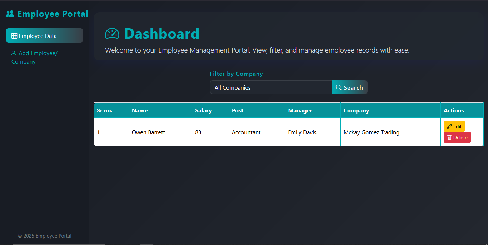

# Employee Portal Dashboard

Deploy Link https://pr-oops-js.vercel.app/index.html

## Screenshot

A modern, responsive Employee Management Portal built with JavaScript and Bootstrap 5.  
This project demonstrates OOPS concepts (Inheritance, Polymorphism, Abstraction) in JavaScript and provides a professional UI for managing employees and companies.

## Features

- **Modern Dark UI** with glassmorphism and sidebar navigation
- **Employee Data Table**: View, filter, edit, and delete employees
- **Add Employee/Company**: Add new employees or companies via forms
- **Company Filter**: Filter employees by company
- **Responsive Design**: Works on desktop and mobile
- **OOPS Concepts**: Clean code using classes and inheritance

## Technologies Used

- HTML5, CSS3 (with Bootstrap 5)
- JavaScript (ES6+)
- Bootstrap Icons
- LocalStorage for data persistence

